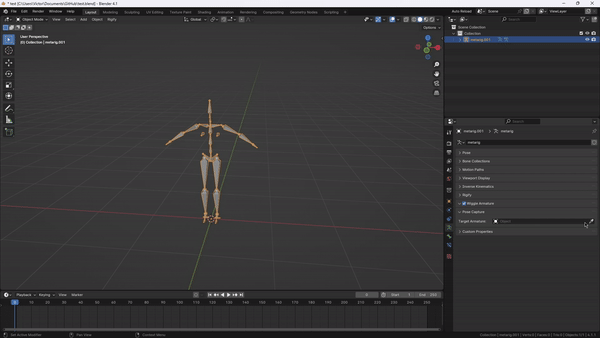
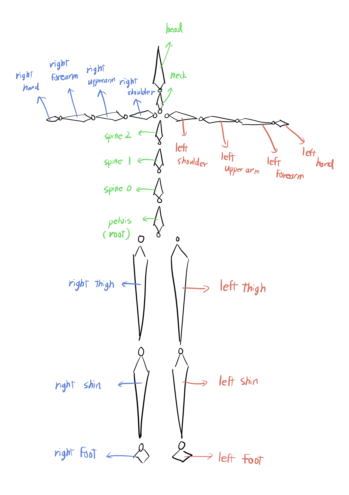
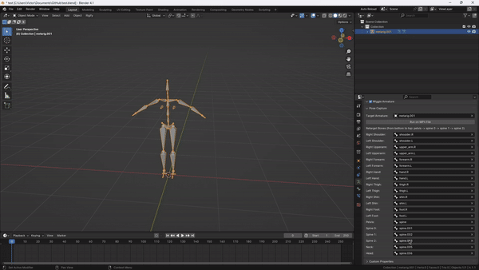

## Pose Capture

This is a Blender addon that helps you capture motions in a video and copy the motions to a rig!

### Installation

You can simply download this .zip file and select it through Edit -> Preferences -> Add-ons -> Install.

However, this addon requires the cv2 and mediapipe libraries. There are several ways to do this. You can open the "installations.py" included in Blender and run it. If this doesn't work, you can try the following ways:

* Other Ways: 
    - Create Conda Environment: https://medium.com/@yunqiguo/install-mediapipe-in-blender-d75177123410
        - python version: 3.9, blender version: 3.0
        - pip install mediapipe (version 0.10.5)
        - pip install opencv-python
        - link python environment to blender python directory
      

### How to use
##### Step 1.  Select your armature and  retargeting bones.

The addon will be in the "data" properties. After installation, you would see a "Pose Capture" tab where you could choose the armature and select each bone for retargeting.

* Note: The retargeting method is in accordance with the Blender metarig. Here is the diagram of how each bone should be retargeted: 
    
##### Step 2.  Choose video and run.

There is a "Run on MP4 File" button in the tab. You could choose a video in your computer, and the program will automatically detect the pose of the video, and then copy the animation in the video to the armature selected.

* Note: Press ESC to interrupt playing the video.

#### Bugs:
Please let me know!
